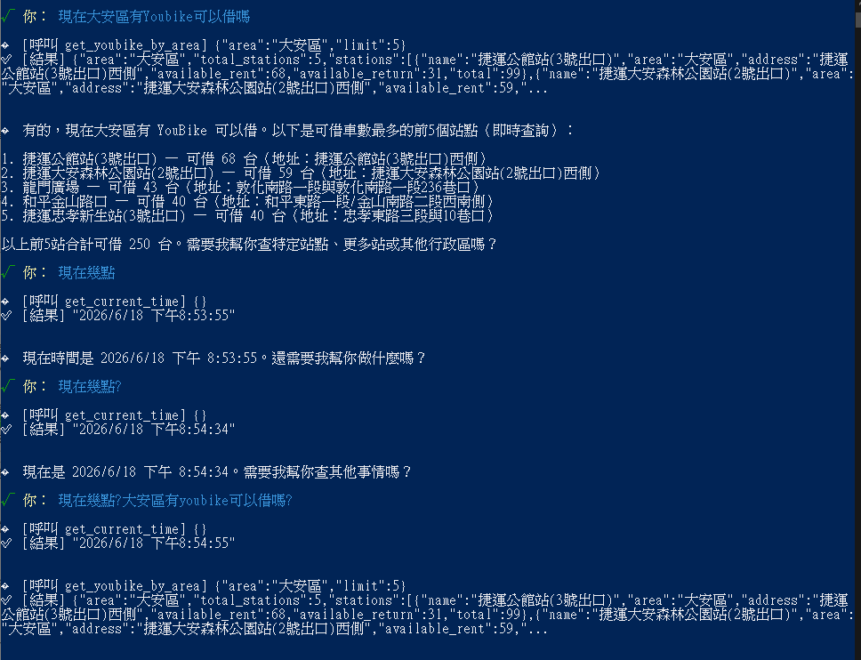

# 作業 4：整合 YouBike 與時間工具

## 檔案結構

```
ai-agent-hw4/
├── tools/
│   ├── current_time.js       # ⭐ 時間工具
│   ├── youbike.js            # ⭐ YouBike 工具(行政區查詢版)
│   └── index.js              # ⭐ barrel export(集中匯出所有工具)
├── utils/
│   ├── func-tool.js          # defineTool + toOpenAITool (zodFunction wrapper)
│   └── spinner.js            # CLI 載入動畫
├── lib/openai.js             # OpenAI client
├── db/messages.js            # 對話歷史(lowdb)
├── main.js                   # ⭐ 主程式:對話迴圈 + tool calling + 記憶
├── config.js
├── package.json / .env.example / .gitignore
└── .history/                 # 每次跑 main.js 會留對話紀錄
```

## 工具註冊

```js
import * as allTools from "./tools/index.js";

const toolList = Object.values(allTools);
const tools = toolList.map(toOpenAITool);                          // 給 OpenAI 的 schema 陣列
const AVAILABLE_TOOLS = Object.fromEntries(
  toolList.map((t) => [t.name, t.fn]),                             // dispatcher 對應表
);
```

`tools/index.js`：
```js
export { currentTimeTool } from "./current_time.js";
export { youbikeTool } from "./youbike.js";
```

## 工具定義（zod schema）

```js
// 時間工具(無參數)
export const currentTimeTool = defineTool({
  name: "get_current_time",
  description: "取得現在的台灣時間",
  fn: getCurrentTime,
  parameters: z.object({}),
});

// YouBike 工具(行政區查詢)
export const youbikeTool = defineTool({
  name: "get_youbike_by_area",
  description: "查詢指定台北市行政區內的 YouBike 2.0 站點，回傳目前可借車數最多的前幾個站點。注意:只能傳台北市的「行政區」名稱(例如「大安區」「信義區」「中山區」),不能傳「台北市」或非行政區名稱。",
  fn: getYoubikeByArea,
  parameters: z.object({
    area: z.string().describe("台北市行政區名稱,例如「大安區」、「信義區」、「中山區」、「士林區」..."),
    limit: z.number().default(5).describe("回傳站點數上限,預設 5"),
  }),
});
```

## System Prompt 設計

```
你是一位住在台北的小助理,能幫使用者查詢:
1. 現在時間(透過 get_current_time 工具)
2. 台北市各行政區的 YouBike 2.0 站點目前可借車數(透過 get_youbike_by_area 工具)

當使用者詢問時間或台北市 YouBike 相關問題時,請主動呼叫對應的工具,不要自己猜測。
YouBike 查詢只能傳台北市行政區名稱(例如「大安區」「信義區」「中山區」),不能直接傳「台北市」這種非行政區名稱...
請全程用繁體中文回答,把工具回傳的資料整理成自然口語句子。如果使用者一句話問了多件事,請把所有需要的工具都呼叫完再整合回答。
```
---

## 實測對話紀錄

執行截圖：


